# 🚦 Smart Traffic Routing — Big Data, Machine Learning & Graph Algorithms for Real-Time Congestion Prediction

**Tagline:**  
**“From traffic sensors to smarter cities: real-time congestion prediction with Kafka, Spark, LSTM, XGBoost, and dynamic routing powered by graph algorithms.”**

---

  
  
  
  
  
  
  
  


---

---

## 📘 Overview

Urban mobility faces major challenges: **congestion, delays, and inefficiency**.  
Reactive systems (like GPS navigation apps) update only after congestion happens.  
Our solution is **proactive** — it **predicts congestion in advance** and dynamically adjusts routing.

**Core Highlights:**
- **Real-time ingestion** of traffic, weather, and incident data with **Apache Kafka**.  
- **Stream processing & feature joins** using **Apache Spark Structured Streaming**.  
- **Time-series forecasting** with **LSTM** (flow, speed, occupancy).  
- **Congestion classification** with **XGBoost** and **KNN baseline**.  
- **Dynamic route optimization** using **Dijkstra & A*** on predicted congestion.  
- **Dashboards & analytics** via **Kibana/Elasticsearch** and **Streamlit** apps.  

This project is an **end-to-end Big Data system** combining:  
- **Data Engineering** (Kafka, Spark, Elasticsearch)  
- **Machine Learning** (LSTM, XGBoost, KNN, evaluation metrics)  
- **Graph Algorithms** (shortest path with predicted costs)  
- **Visualization** (real-time dashboards for decision-making)  

👉 A full-stack Smart City solution for **predictive, data-driven traffic management**.

## 1) Executive Summary 

### The Problem
Urban corridors suffer from recurrent congestion that reactive navigation can’t prevent. By the time traffic maps “turn red,” drivers are already stuck.

### Our Solution
**Smart Traffic Routing** is a **proactive** system that **predicts congestion ahead of time** and computes **dynamic, congestion-aware routes**—end to end:

- **Real-time ingestion** with **Apache Kafka** (traffic sensors, weather, incidents/simulations)
- **Stream processing** with **Apache Spark Structured Streaming** (joins, aggregations, feature windows)
- **ML layer**: **LSTM** for time-series forecasting (flow/speed/occupancy) + **XGBoost** for congestion classification
- **Routing layer**: **Dijkstra & A\*** where **edge costs** are adjusted by **predicted congestion**
- **Visualization**: **Streamlit** app for operator/reviewer workflows (live scores, routes, explanations)

### End-to-End Flow (At a Glance)


In short: **From data ingestion → ML prediction → optimized routing → real-time dashboards** — an **end-to-end Smart City Big Data solution**.

### Why It Matters

- **Proactive:** routes avoid *future bottlenecks*, not just current ones.  
- **Scalable:** Kafka + Spark handle high-velocity streams and windowed joins.  
- **Explainable:** Streamlit surfaces predicted congestion and route choices.  
- **Deployable:** modular services; batch or streaming; Python-first stack.  

---

### Outcomes (Highlights)

- Integrated **multi-stream data** (traffic, weather, incidents) in real time.  
- Forecasted key signals (**flow / speed / occupancy**) with **LSTM**.  
- Classified **congestion levels** with **XGBoost** to guide routing.  
- Computed **dynamic shortest paths** using **Dijkstra / A\*** with predicted edge costs.  
- Exposed operator UI via **Streamlit** for live monitoring and demo.  

---

### Impact

- This project demonstrates how Big Data + Machine Learning + Graph Algorithms can power Smart City traffic systems:
- Proactive congestion prediction
- Optimized routing before delays happen
- Scalable architecture (Kafka + Spark)
- Operator-friendly dashboards (Streamli

--- 

## 2) Demo Walkthrough — Streamlit Dashboards

The system provides an **interactive Streamlit dashboard** that allows operators or end-users to monitor live traffic data, view predictions, and explore optimized routes.  

The demo experience is structured in three stages:

---

### 1. Dashboard Overview (Live Data & Streams)

The first panel shows a **real-time overview** of traffic, weather, and incident data streaming in via **Kafka producers** and processed by **Spark Structured Streaming**.  
- Operators can see data freshness and availability.  
- Provides confidence that **multi-stream ingestion** is running.  

*Screenshot:*  


---

### 2. Congestion Prediction (ML Layer Outputs)

The second panel shows **predicted congestion levels** across routes.  
- **LSTM forecasts** traffic flow, occupancy, and speed into the near future.  
- **XGBoost** classifies congestion levels: *low, medium, high*.  
- Predictions update continuously as new data streams arrive.  

📸 *Screenshot:*  


---

### 3. Route Optimization (Graph Algorithms)

The third panel integrates predictions into **dynamic routing**.  
- Graph edges (roads) are weighted by predicted congestion.  
- **Dijkstra** and **A\*** algorithms compute shortest paths under these conditions.  
- The dashboard shows:  
  - **Recommended route** (minimizing predicted congestion).  
  - **Alternate routes** for comparison.  
  - **Estimated travel times** based on predictions.  

*Screenshot:*  


---

### End-to-End Demo Flow

1. **Data arrives in real time** via Kafka producers (traffic, weather, incidents).  
2. **Spark joins streams** and computes features in sliding windows.  
3. **ML models predict** congestion ahead of time.  
4. **Graph algorithms optimize** routes with predicted edge weights.  
5. **Streamlit dashboards visualize** predictions and route recommendations live.  

Together, the dashboards turn **raw streaming data into actionable routing decisions**.

---

## 3️⃣ System Architecture — Big Data + ML + Routing

This project is an **end-to-end Big Data system** that integrates **real-time data engineering, machine learning, and graph algorithms** into a **smart traffic routing solution**.  

It follows a **streaming-first architecture**, ensuring **low-latency processing, fault tolerance, and scalability** across heterogeneous data sources.

---

### System Architecture — Runtime Sequence (Streaming & Inference)

```mermaid
sequenceDiagram
    autonumber
    participant TrafProducer as Traffic Producer
    participant WxProducer as Weather Producer
    participant IncProducer as Incident Producer
    participant Kafka as Apache Kafka (Topics: traffic-data, weather-data, incident-data)
    participant Spark as Spark Structured Streaming Job
    participant Feature as Feature Pipeline (lags, rolling stats)
    participant LSTM as LSTM Inference (Forecasts)
    participant XGB as XGBoost Inference (Congestion)
    participant Router as Routing Engine (Dijkstra / A*)
    participant UI as Streamlit Dashboard

    rect rgb(245,245,245)
    note over TrafProducer,IncProducer: Producers push events continuously (5-min sensor ticks + weather/incident updates)
    TrafProducer->>Kafka: produce(traffic-event, partition=hash(sensorId))
    WxProducer->>Kafka: produce(weather-event, partition=hash(areaId))
    IncProducer->>Kafka: produce(incident-event, partition=hash(roadSeg))
    end

    rect rgb(235,245,255)
    note over Spark: Micro-batch triggers (e.g., trigger=processingTime:30s) with watermarking & checkpoints
    Kafka-->>Spark: subscribe([traffic-data, weather-data, incident-data])
    Spark->>Spark: Parse JSON, schema enforce, late data handling (watermark)
    Spark->>Feature: Windowed joins (e.g., 30m sliding, 5m step)
    Feature->>Feature: Build features (rolling mean/max, lags, deltas, categorical encodings)
    end

    rect rgb(255,245,235)
    note over LSTM,XGB: Low-latency inference (vectorized UDFs / model server)
    Feature->>LSTM: predict([flow, speed, occupancy]_t+Δ)
    LSTM-->>Feature: forecasts_t+Δ
    Feature->>XGB: classify(congestion_level | features ⊕ forecasts)
    XGB-->>Feature: labels: {low, medium, high} + probs
    end

    rect rgb(245,255,245)
    note over Router: Build congestion-aware edge weights
    Feature->>Router: edgeCost = f(forecasts, congestion_label, incident_severity, weather)
    Router->>Router: run Dijkstra / A* (heuristic=haversine)
    Router-->>UI: bestRoute, altRoutes, ETA, costBreakdown
    end

    rect rgb(250,250,255)
    note over UI: Live refresh (poll/WS) to visualize predictions & routes
    UI-->>UI: Render tiles, charts, tables (next-refresh≈30s)
    end

    opt Backpressure & Fault Tolerance
        Spark-->>Spark: Adaptive rate, stateful recovery (checkpointDir)
        Kafka-->>Spark: Resume from last committed offsets
    end

    opt Batch/Replay (for re-training or audits)
        UI->>Kafka: request topic offsets / time range
        Kafka-->>Spark: deliver historical windows
        Spark->>LSTM: batch forecasts
        Spark->>XGB: batch classifications
    end
```



## 🔹 Data Ingestion Layer (Kafka)

- **Apache Kafka topics** for traffic, weather, and incident data.  
- **Producers** publish 5-minute sensor readings + real-time weather & incident events.

**Kafka ensures**
- **Durability:** commit logs, configurable replication factor  
- **Scalability:** partitioned topics → multiple consumers in parallel  
- **Fault tolerance:** consumers restart from stored offsets

**Kafka producers (screenshots)**

Kafka Producer for Traffic Data.png


-----

Kafka Producer for Weather Data.png


---

Kafka Incident Producer.png


---

### Stream Processing Layer (Spark Structured Streaming)

- **Micro-batching & windowed joins** combine traffic, weather, and incident streams.  
- **Sliding windows** capture temporal context (e.g., last 30 minutes).

**Feature engineering**
- Rolling averages, lags, normalized flow/speed  
- Derived congestion indicators

**Resilience**
- **Backpressure** adapts to spikes  
- **Checkpointing:** `~/spark-checkpoints/` (for exactly-once sinks where applicable)

- *Stream joins:*
  
  
- *Spark pipeline:*
 

---

## ML Layer (Prediction)

### LSTM (Long Short-Term Memory)
- Predicts **flow, occupancy, speed** into the near future  
- Handles temporal dependencies in streaming data  
- Loss: **RMSE / MAE**  
- Supports real-time inference via **Spark UDF** integration


### XGBoost (Congestion Classifier)
- Classifies **congestion levels** (low / medium / high)  
- Consumes **engineered + forecasted features**  
- Optimized via **tree-based boosting**

- *Model Training:*
 

---

## Routing Layer (Graph Algorithms)

- **Graph nodes** = intersections / traffic sensors  
- **Graph edges** = road segments with **predicted congestion costs**

**Algorithms**
- **Dijkstra:** globally shortest paths  
- **A\*:** faster with heuristic (e.g., Euclidean distance)

**Outputs**
- Optimized route(s) + alternatives  
- Estimated travel times (ETAs)

---

## 🔹 Visualization Layer (Streamlit)

- **Streamlit dashboards** for operators / end-users

**Panels**
- Live ingestion status (**Kafka → Spark**)  
- Predicted congestion maps  
- Optimized routes & travel time comparisons  
- Designed for **real-time decision-making**

*Screenshots placeholders*  
- *Dashboard Overview:*

   
  
- *Predictions Panel:* 

   
  
- *Routes Panel:*

   

---

## Big Data Strengths

- **Scalable ingestion** (Kafka partitions for high-volume streams)  
- **Fault tolerance** (Spark checkpointing + Kafka offsets)  
- **Distributed computation** (parallel Spark executors)  
- **Near real-time latency** (structured streaming micro-batches)  
- **Elastic pipeline** → extensible to IoT / autonomous vehicles

---

## 4) Data & Preprocessing — Streaming, Windows, and Feature Builds

This system treats data as a **continuously arriving stream**. We engineer features **online** in Spark, using **windowed joins**, **watermarking** for late data, and **micro-batch** triggers for low latency.

---

### Unified Streaming Schema (Examples)

**Traffic events (PeMS-derived)**
```json
{
  "event_time": "2025-09-20T12:05:00Z",
  "station_id": "BA_237_0145",
  "freeway_id": "CA_237",
  "lat": 37.422, "lon": -122.084,
  "flow": 124, "speed": 47.3, "occupancy": 0.31
}
```
**Weather events**
```json
{
  "event_time": "2025-09-20T12:05:00Z",
  "area_id": "zone_237",
  "temp_c": 23.4, "precip_mm": 0.0, "wind_kph": 7.2, "visibility_km": 10
}
```
**Incident events**
```json
{
  "event_time": "2025-09-20T12:04:00Z",
  "road_segment": "CA_237:BA_237_0140->BA_237_0145",
  "severity": 2, "type": "minor_collision", "lanes_blocked": 1
}
```
### Streaming Joins & Watermarks (Spark)

- **Micro-batch trigger** → e.g., `processingTime=30s` for near-real-time updates  
- **Event-time windows** → e.g., 30-minute sliding windows with 5-minute slide to align heterogeneous streams  
- **Watermarking** → e.g., `withWatermark("event_time", "20 minutes")` to bound state and tolerate late data  
- **Stateful processing & checkpointing** → ensures fault tolerance with **exactly-once semantics** (leveraging Kafka offsets)  

### Pseudo-code (PySpark):

```python
traffic  = spark.readStream.format("kafka").option("subscribe","traffic-data" ).load()
weather  = spark.readStream.format("kafka").option("subscribe","weather-data" ).load()
incident = spark.readStream.format("kafka").option("subscribe","incident-data").load()

# Parse → enforce schema → event-time watermark
t = parse(traffic ).withWatermark("event_time","20 minutes")
w = parse(weather ).withWatermark("event_time","20 minutes")
i = parse(incident).withWatermark("event_time","20 minutes")

# 30-min window, 5-min slide
from pyspark.sql.functions import window

tw = t.groupBy(window("event_time","30 minutes","5 minutes"), "station_id") \
       .agg(avg("flow").alias("flow_avg"),
            avg("speed").alias("speed_avg"),
            avg("occupancy").alias("occ_avg"))

ww = w.groupBy(window("event_time","30 minutes","5 minutes"), "area_id") \
       .agg(avg("temp_c").alias("temp_avg"),
            avg("precip_mm").alias("precip_avg"),
            avg("wind_kph").alias("wind_avg"))

# Spatial/ID alignment (e.g., station->area mapping) + incidents left join
joined = tw.join(mapStationsToAreas, "station_id") \
           .join(ww, ["area_id","window"]) \
           .join(i,  expr("road_segment like concat('%', station_id, '%')")
                     & (i.event_time.between(col("window.start"), col("window.end"))),
                 "left")
```
## ⚙️ Online Feature Engineering

We compute **time-aware** and **context-aware** features in stream:

- **Rolling stats:** mean / median / max of flow, speed, occupancy within window  
- **Lags & deltas:** \( flow_t - flow_{t-1} \), captures trend/acceleration  
- **Weather impact:** `precip_avg`, `wind_avg`, interaction terms (\( occ\_avg \times precip\_avg \))  
- **Incident features:** severity, blocked lanes, time since incident  
- **Edge features:** map station pairs → road segments for routing  

---

### Cosine Similarity (incident–segment relevance, optional)

$$
\text{sim}(u, v) = \frac{u \cdot v}{\|u\| \cdot \|v\|}
$$

*(Using embeddings of segment text metadata / incident type to modulate cost.)*

---

### Normalization (min–max by window)

$$
x' = \frac{x - \min(x)}{\max(x) - \min(x)}
$$

---

### Congestion Proxy (classic density model)

$$
congestion\_score = \alpha \cdot \Big(1 - \frac{speed}{speed\_{free}}\Big) + \beta \cdot occupancy
$$

### Feature Lineage (From Raw → Model)

```mermaid
flowchart TB
  RAW_T[Raw Traffic] --> WS[Windowed Stats]
  RAW_W[Raw Weather] --> WS
  RAW_I[Raw Incidents] --> ENR[Enrichment/Joins]

  WS --> LAGS[Lags & Deltas]
  ENR --> LAGS
  LAGS --> NORM[Scaling/Normalization]
  NORM --> F_LSTM[Feature Vector → LSTM]
  NORM --> F_XGB[Feature Vector → XGBoost]
```



### Big-Data Engineering Choices

- **Kafka partitions** (by `station_id` / `area_id`) → parallelism & ordered per-key processing  
- **Watermarks** → bounded state for late / out-of-order events  
- **Checkpointing** → consistent recovery after failures  
- **Vectorized UDFs / model servers** → low-latency inference for LSTM / XGBoost  
- **Schema enforcement** → robust against producer drift  

---

### Validation in Stream

- **Drift monitors:** alert on shifts in `speed_avg`, `occ_avg` distributions  
- **Data quality:** null-rate, outlier caps, unit checks (e.g., \(0 \leq occupancy \leq 1\))  
- **A/B thresholds:** compare route ETA using current vs predicted congestion weights  

---

## 5) Machine Learning Models — Forecasting & Classification

Traffic is inherently **temporal** (patterns repeat daily/weekly) and **contextual** (affected by weather/incidents).  
We designed a **two-stage ML pipeline**:

1. **LSTM (Long Short-Term Memory)** → Time-series forecasting of traffic flow, speed, and occupancy.  
2. **XGBoost (Extreme Gradient Boosting)** → Congestion classification (low, medium, high) using engineered + forecasted features.  

---

### Stage 1: LSTM for Time-Series Forecasting

LSTM is a recurrent neural network architecture capable of learning **long-term dependencies** in sequential data.  
It was chosen for **flow/speed/occupancy prediction**.

**Inputs (per station):**  
- Past N windows of `flow_avg`, `speed_avg`, `occ_avg`  
- Weather features (`temp_avg`, `precip_avg`, `wind_avg`)  
- Incident severity/time-since-last-incident  

**Outputs:**  
- Predicted `flow`, `speed`, and `occupancy` for future intervals.  

---

### Stage 2: XGBoost for Congestion Classification

Forecasts + engineered features are passed to **XGBoost** to classify congestion level.  

**Features:**
- Rolling stats: mean/max/min of flow/speed/occ.  
- LSTM forecasts (t+5, t+10 min horizon).  
- Weather features (rain, wind, temp).  
- Incident features (severity, lane closures).  

**Labels:**  
- `0 = Low congestion`  
- `1 = Medium congestion`  
- `2 = High congestion`  

---

### Model Evaluation

We used multiple metrics to capture **fairness & accuracy**:

- **RMSE (Root Mean Squared Error)** for LSTM forecasts.  
- **Precision, Recall, F1-score** for XGBoost classifications.  
- **Balanced Accuracy** to handle class imbalance.  
- **Matthews Correlation Coefficient (MCC)** as a robust metric.

---

### Insights from Experiments

- **LSTM**: captured daily/weekly periodicity, reduced RMSE significantly over naive baselines.  
- **XGBoost**: delivered balanced precision and recall, outperforming simple classifiers (KNN baseline).  
- **Combined pipeline** (LSTM → XGBoost): improved overall prediction stability and route optimization accuracy.  

> *Key takeaway*: This hybrid ML design leveraged **deep learning for sequence prediction** and **boosted trees for interpretable classification** — a powerful combination for real-time traffic systems.

---

## 6) Routing Engine — Graph Algorithms for Dynamic Paths

Predicting congestion is only half the solution.  
We use **graph algorithms** to compute **dynamic, congestion-aware routes** in real time, where **edge weights** are adjusted by ML-predicted traffic conditions.

---

### Graph Representation

- **Nodes (V):** traffic stations/intersections (from PeMS dataset).  
- **Edges (E):** road segments between stations.  
- **Edge Weights (w):**  
  - Traditionally: distance or travel time.  
  - In our system: adjusted travel time using ML forecasts:  

$$
w(u,v) = base\_time(u,v) \times \big(1 + \alpha \cdot congestion\_score_{uv}\big)
$$

Where:  
- \( base\_time(u,v) \) = free-flow travel time.  
- \( congestion\_score_{uv} \) = derived from LSTM + XGBoost predictions.  
- \( \alpha \) = scaling factor (penalizes predicted congestion).  

---

### Algorithm 1: Dijkstra’s Shortest Path

**Goal:** compute the minimum-cost path from source → destination.  

**Steps:**  
1. Initialize distances: \( dist[source] = 0 \), others = ∞.  
2. Use a min-priority queue (heap) to explore nodes.  
3. Relax edges: if \( dist[u] + w(u,v) < dist[v] \), update \( dist[v] \).  
4. Repeat until destination reached.  

**Complexity:**  

$$
O\big((V + E)\log V\big)
$$  

(using a binary heap).  

**Strengths:**  
- Finds exact shortest path.  
- Works with **dynamic, weighted graphs** (our predicted edge costs).  

---

### Algorithm 2: A* Search

**Goal:** faster pathfinding using **heuristics**.  

**Heuristic Function (h):** estimated cost from node → destination.  
We use **Euclidean distance** between coordinates:  

$$
h(v) = \sqrt{(lat_v - lat_{dest})^2 + (lon_v - lon_{dest})^2}
$$

**Total Cost Function:**

$$
f(v) = g(v) + h(v)
$$

Where:  
- \( g(v) \) = known cost from source → v.  
- \( h(v) \) = heuristic (straight-line distance).  

**Complexity:**  
- Much faster than Dijkstra in practice.  
- Same optimality guarantee if \( h(v) \) is admissible (never overestimates).  

---

### Integration with ML Predictions

1. Spark streaming pipeline produces **predicted congestion scores** (per road segment).  
2. These scores update **edge weights** dynamically in the routing graph.  
3. Dijkstra or A* recomputes paths in **real time** as new predictions arrive.  
4. Results are pushed to **Streamlit dashboards**:  
   - Optimized route  
   - Alternative paths  
   - Estimated travel times  
---

### Why This Matters

- **Dynamic routing:** adapts to predicted, not just current, congestion.  
- **Scalable design:** graph algorithms run efficiently with thousands of nodes/edges.  
- **Hybrid approach:**  
  - Dijkstra for **guaranteed optimal paths**.  
  - A* for **low-latency heuristic search**.  
- **Real-world impact:** enables connected cars and smart city controllers to choose **routes that stay clear**, not just react to congestion.


## 7) Experiments & Results

To validate the pipeline, we ran **end-to-end experiments** covering ML model training, congestion classification, and dynamic routing.  

---

### ML Model Performance

We evaluated LSTM (forecasting) and XGBoost (classification) on cleaned PeMS traffic data, joined with weather and incident streams.

| Model         | Task                          | Metric                | Result (example) |
|---------------|-------------------------------|-----------------------|------------------|
| LSTM          | Flow/speed/occupancy forecast | RMSE (flow)           | ~7.5             |
|               |                               | MAE (speed)           | ~3.2             |
| XGBoost       | Congestion classification     | Precision             | 0.82             |
|               |                               | Recall                | 0.79             |
|               |                               | F1-score              | 0.80             |
|               |                               | Balanced Accuracy     | 0.81             |
|               |                               | MCC                   | 0.65             |
| KNN (baseline)| Congestion classification     | F1-score              | 0.70             |

---

### Interpretation of Results

- **LSTM** reduced RMSE significantly vs. naive baselines (periodic averages).  
  - Captured daily/weekly cycles in flow/occupancy.  
  - Forecast errors grew in highly volatile conditions (incidents, sudden weather).  
- **XGBoost** balanced precision/recall better than Logistic Regression or KNN.  
  - Precision (82%) → fewer false alarms.  
  - Recall (79%) → still caught most congestion events.  
- **Combined pipeline** → forecasts + classification improved routing accuracy.  
  - Predicted congestion labels fed directly into routing engine.  
- **MCC (0.65)** → indicates strong correlation between predicted and actual classes even with class imbalance.  

---

### Streamlit Dashboards — Evidence

**1. Dashboard Overview (Live Streams)**  
Shows ingestion from Kafka (traffic, weather, incidents) processed in Spark.  
*Screenshot:*  


---

**2. Congestion Predictions (ML Outputs)**  
Displays LSTM + XGBoost results: predicted congestion levels per road segment.  
*Screenshot:*  


---

**3. Optimized Routes (Graph Engine)**  
Highlights congestion-aware routing results.  
- Green path = recommended (shortest adjusted time).  
- Grey paths = alternatives.  
- Estimated travel times visible.  
*Screenshot:*  


---

### Key Takeaways

- **ML Models**: Hybrid LSTM + XGBoost pipeline provided balanced and accurate forecasts/classifications.  
- **Graph Engine**: Dynamic shortest path (Dijkstra/A*) reduced expected travel times compared to static routes.  
- **System Validation**: End-to-end demo (Kafka → Spark → ML → Routing → Streamlit) proved scalability and real-time performance.  

> Overall, results confirm that **Big Data + ML + Graph Algorithms** can power **proactive, real-time traffic routing** for smart cities.


## 8️⃣ Big Data — Streaming & Scalability

This project demonstrates **hands-on expertise in Big Data frameworks** (Apache Kafka + Apache Spark) and how they enable **scalable, fault-tolerant, real-time traffic routing**.  

---

### Streaming Dataflow (Big Data View)


---

### Kafka Design — High-Throughput Ingestion

- **Partitioning strategy**:  
  - Topics (`traffic-data`, `weather-data`, `incident-data`) are **partitioned by station_id or area_id**.  
  - Ensures **ordered event processing per station** while enabling **parallelism across partitions**.  
  - This allows Spark executors to **scale linearly** with more partitions.  

- **Consumer groups**:  
  - Multiple Spark jobs can subscribe independently (real-time routing, archival ETL, monitoring dashboards).  
  - Each group maintains its own offsets → **multi-application consumption without interference**.  

- **Replication**:  
  - Kafka brokers replicate logs → tolerate broker failures without data loss.  
  - This guarantees ingestion reliability for critical IoT traffic data.  

---

### Spark Structured Streaming — Real-Time Feature Engineering

- **Triggering mode**:  
  - Micro-batch trigger (`trigger=30s`) → predictable latency (~30s per update).  
  - Optimized for balancing throughput vs. real-time responsiveness.  

- **Event-time alignment**:  
  - **Sliding windows (30 min length, 5 min slide)** align traffic, weather, and incident streams.  
  - **Watermarks (20 min)** prune late data while tolerating sensor delays/out-of-order events.  

- **Fault tolerance**:  
  - **Checkpointing** (`spark-checkpoints/`) stores offsets + state store snapshots.  
  - Guarantees **exactly-once semantics** when writing features to downstream sinks.  

- **Backpressure control**:  
  - Spark adapts batch size to ingestion rate.  
  - Prevents system overload during **rush-hour surges** without dropping data.  

---

### ML Integration at Scale

- **Vectorized UDFs**: ML models (LSTM + XGBoost) integrated into Spark via Pandas UDFs → efficient batch inference per partition.  
- **Hybrid ML pipeline**:  
  - LSTM forecasts temporal sequences (flow/speed/occupancy).  
  - XGBoost consumes **forecasts + rolling features** for congestion classification.  
- **Streaming inference**: Predictions update continuously as Spark processes new micro-batches.  

*This design shows how to serve ML in a distributed streaming environment — a key Big Data ML skill.*

---

### Scalability & System Design Trade-offs

- **Scaling out**: Add Kafka partitions + Spark executors → higher throughput without downtime.  
- **Resource elasticity**: Executors scale based on load; producers scale independently.  
- **Recovery**: Spark jobs can crash/restart → resume seamlessly from last committed Kafka offset + checkpoint.  
- **Throughput vs Latency**:  
  - More frequent triggers = lower latency but higher overhead.  
  - Larger batch intervals = higher throughput but increased staleness.  
  - We tuned for ~30s end-to-end delay.  

---

### Advanced Big Data Features in this Project

1. **Replay & Retraining**  
   - Kafka’s log retention allows replaying historical traffic data.  
   - Enables **continuous ML retraining** when congestion patterns drift (concept drift).  

2. **Lambda-style architecture**  
   - **Streaming path**: live predictions + routing.  
   - **Batch path**: replay logs for model evaluation, parameter tuning, or historical analytics.  

3. **Schema enforcement**  
   - Spark applies strict schemas → protects against malformed producer messages.  
   - Prevents downstream ML crashes due to schema drift.  

4. **Stateful aggregations**  
   - Spark maintains **rolling features (lags, averages)** in its state store.  
   - Checkpointing ensures **state recovery** across failures.  

---

### Why This Matters

This system demonstrates true **Big Data engineering expertise**:

- **Kafka**: partitioning, replication, multi-consumer design.  
- **Spark Structured Streaming**: micro-batches, watermarking, checkpointing, backpressure.  
- **ML at scale**: streaming inference with vectorized UDFs.  
- **Scalability**: horizontal scaling from a few traffic stations → thousands across a metro area.  
- **Resilience**: tolerates late data, spikes, failures, schema drift.  
- **Replayability**: historical reprocessing for ML retraining + audits.

---

## 9) Quickstart — Run the Project Locally

### 1. Clone & Setup Environment
```bash
git clone https://github.com/devarshpatel1506/smart_traffic_routing.git
cd smart_traffic_routing
python -m venv .venv && source .venv/bin/activate
pip install -r requirements.txt
```

### 2. Start Kafka & Producers

- Run Zookeeper + Kafka broker (Docker or local install).
- Then start the producers (traffic, weather, incidents):
```bash
# Start Traffic Producer
python producers/kafka_traffic_producer.py

# Start Weather Producer
python producers/kafka_weather_producer.py

# Start Incident Producer
python producers/kafka_incident_producer.py
```

### 3. Run Spark Structured Streaming Job

- Consumes the Kafka topics, performs windowed joins & feature engineering, and outputs features for ML inference.

```bash
spark-submit \
  --jars $(echo ~/spark-jars/*.jar | tr ' ' ',') \
  streaming/spark_streaming_job.py
```

### 4. Launch ML Models & Routing

- Trained LSTM + XGBoost models are used for real-time predictions and route optimization.

```bash
python ml/predict_and_route.py
```

### 5. Open Streamlit Dashboard

- Visualize congestion predictions and optimized routes:

```bash
streamlit run dashboard/app.py
```
## 10) License

This project is licensed under the **MIT License** — see the [LICENSE](LICENSE) file for details.


